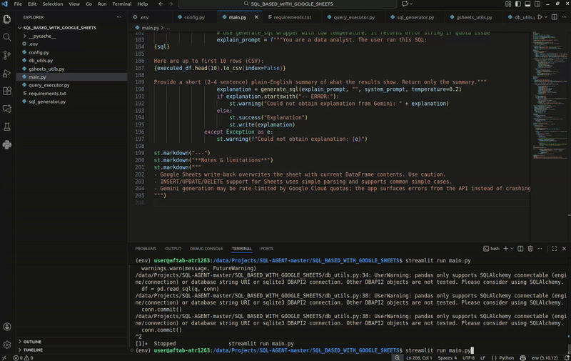

# Text-to-SQL Agent (MySQL + Google Sheets + Gemini)

A Streamlit-based application that converts natural language text into SQL queries using **Google Gemini LLM**, and executes queries on **MySQL** or **Google Sheets**. Users can view, insert, update, or delete data interactively.

---

## Features

- Convert natural language questions into SQL queries using Gemini LLM.
- Connect and query **MySQL databases**.
- Connect and query **Google Sheets** as a database.
- Execute SELECT, INSERT, UPDATE, DELETE operations.
- Naive SQL handling for Google Sheets (via pandasql + in-memory DataFrame).
- Push updates back to Google Sheets automatically.
- Optionally get a **short summary of results** using Gemini.
- Single interface for both MySQL and Google Sheets queries.
- Easy configuration via environment variables or service account JSON.

---

## Screenshots

### Login / Connection


### MySQL Connection


### Google Sheets Connection


### Query Execution


---

## Video Demo

<video width="600" controls>
  <source src="media/vd1.webm" type="video/webm">
  Your browser does not support the video tag.
</video>
](media/vd1.webm)

> Click on the video thumbnail to watch the demo.

---

## Requirements

- Python 3.10+
- Packages:

```bash
pip install streamlit mysql-connector-python gspread google-auth google-auth-oauthlib google-auth-httplib2 google-generativeai pandas pandasql


#Environment Variables

##Create a .env file in the project root:

GOOGLE_API_KEY=your_google_gemini_api_key
GSHEET_SERVICE_ACCOUNT_FILE=path_to_service_account.json


#Usage

##Run Streamlit:

streamlit run main.py

1. Select data source: MySQL, Google Sheets, or both.

2. Connect to your database or sheet.

3. Ask your natural language question.

4. View results and optionally update the sheet.